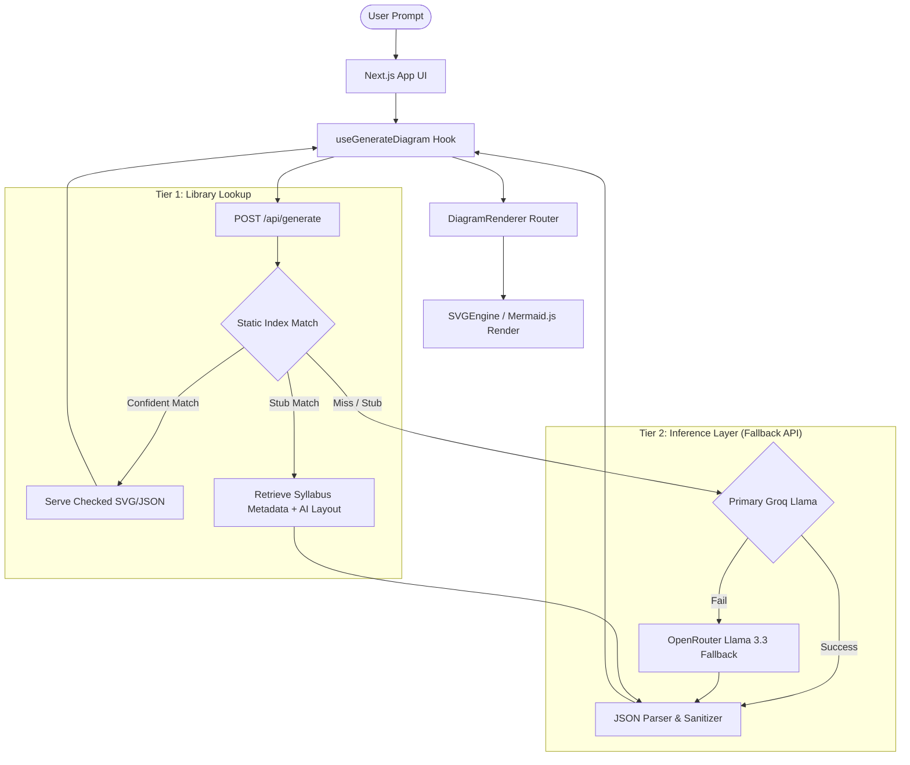

# DiagramAI 🧠

<p align="center">
  
  
  
  <br />
  
  
  
  
</p>

An industry-grade, AI-powered technical diagram generator designed for engineering students, educators, and software professionals. Convert any text, architectural concept, or codebase outline into clean, professional diagrams accompanied by technical theories instantly.

Built with **Next.js 14**, **Groq AI (Llama 3.1/3.3)**, **OpenRouter (as an automatic fallback)**, and **Mermaid.js** / **SVGEngine** for client-side SVG rendering.

🔗 **Live Deployment:** [diagram-ai-gamma.vercel.app](https://diagram-ai-gamma.vercel.app/)

---

## 📺 Application Demo

https://github.com/user-attachments/assets/79ef7a57-297c-4fb4-98ea-5a7d0205e09c

---

## 🌟 Key Features

- ⚡ **Ultra-Fast Generation:** Generates diagrams in under 2 seconds using Groq's high-speed inference engine.
- 🎯 **Automated Diagram Typing:** The AI dynamically determines the best diagram type (Flowcharts, ERDs, Sequence Diagrams, State Diagrams, or Graphs) for your prompt.
- 🎨 **Adaptive Color Theming:** DiagramRenderer parses output SVGs and injects tailor-made color palettes suited to the diagram subject.
- 📖 **Comprehensive Educational Theory:** Each diagram is accompanied by a ~150-word synthesis, highlighting key points and real-world use cases.
- 💾 **Session History:** Keeps track of your last 8 generations in memory so you can hop back and forth instantly.
- 📦 **Export-Ready Output:** Copy raw Mermaid syntax or download production-ready SVGs with a single click.
- 📚 **Static Syllabus Library:** Matches queries against 28 syllabus-aligned engineering diagrams compiled at build-time. Statically matches verified templates with 100% textbook accuracy.
- 🛠️ **Custom SVGEngine:** A premium SVG rendering layer supporting custom types (logic gates, circuit schematics, block diagrams, tree layouts, etc.) with pixel-perfect coordinates.
- 🔗 **Standalone Embed Mode:** Fullscreen embed support for integrating diagrams into external systems (e.g. `/?id=spiral-model&embed=true` is completely chrome-free).

---

## 📚 Mumbai University Syllabus Diagram Catalog

To support the Mumbai University engineering curriculum with 100% textbook-accurate diagrams, DiagramAI includes a compiled index of syllabus-aligned diagrams. These are matched instantly using [Fuse.js](https://fusejs.io) based on aliases, course keywords, and textbook names.

The following **28 pre-verified diagrams** are loaded statically from the [lib/catalog/](file:///Users/akashvishwakarma/Downloads/diagramai/lib/catalog) database:

### 🎒 First Year Engineering (FE)
*   **Semester I:**
    *   **Basic Electrical Engineering (BEE):**
        *   [Superposition Theorem Verification Circuit](file:///Users/akashvishwakarma/Downloads/diagramai/lib/diagrams/electronics/superposition-theorem-circuit.json) (`superposition-theorem-circuit`)
        *   [Thevenin's Equivalent Circuit](file:///Users/akashvishwakarma/Downloads/diagramai/lib/diagrams/electronics/thevenins-theorem-circuit.json) (`thevenins-theorem-circuit`)
        *   [Transformer Equivalent Circuit Model](file:///Users/akashvishwakarma/Downloads/diagramai/lib/diagrams/electronics/transformer-equivalent-circuit.json) (`transformer-equivalent-circuit`)
    *   **Engineering Mechanics (EM):**
        *   [Cantilever Truss Force Resolution](file:///Users/akashvishwakarma/Downloads/diagramai/lib/diagrams/electronics/truss-cantilever-forces.json) (`truss-cantilever-forces`)
*   **Semester II:**
    *   **Engineering Physics-II:**
        *   [Total Internal Reflection in Optical Fiber](file:///Users/akashvishwakarma/Downloads/diagramai/lib/diagrams/networks/optical-fiber-tir.json) (`optical-fiber-tir`)
    *   **Engineering Chemistry-II:**
        *   [Zeolite Water Softening Process](file:///Users/akashvishwakarma/Downloads/diagramai/lib/diagrams/compiler/zeolite-process-flow.json) (`zeolite-process-flow`)

### 💻 Computer Engineering (CMPN)
*   **Semester III:**
    *   **Data Structures (DS):**
        *   [Binary Search Tree (BST) Structure](file:///Users/akashvishwakarma/Downloads/diagramai/lib/diagrams/algorithms/binary-search-tree.json) (`binary-search-tree`)
    *   **Discrete Structures & Graph Theory (DSGT):**
        *   Hasse Diagram of Poset (`hasse-diagram-poset` - Stub)
*   **Semester IV:**
    *   **Database Management Systems (DBMS):**
        *   [Three-Schema Database Architecture](file:///Users/akashvishwakarma/Downloads/diagramai/lib/diagrams/dbms/three-schema.json) (`three-schema`)
    *   **Operating Systems (OS):**
        *   [Process Life Cycle (5-State Model)](file:///Users/akashvishwakarma/Downloads/diagramai/lib/diagrams/os/process-life-cycle.json) (`process-life-cycle`)
*   **Semester V:**
    *   **Computer Networks (CN):**
        *   [OSI Reference Model (7 Layers)](file:///Users/akashvishwakarma/Downloads/diagramai/lib/diagrams/networks/osi-model.json) (`osi-model`)
        *   [TCP/IP Model — 4 Layers](file:///Users/akashvishwakarma/Downloads/diagramai/lib/diagrams/networks/tcp-ip-model.json) (`tcp-ip-model`)
        *   [TCP 3-Way Handshake Connection Establishment](file:///Users/akashvishwakarma/Downloads/diagramai/lib/diagrams/networks/tcp-handshake.json) (`tcp-handshake`)
        *   [DNS Resolution Process](file:///Users/akashvishwakarma/Downloads/diagramai/lib/diagrams/networks/dns-resolution.json) (`dns-resolution`)
        *   [ARP Protocol — Address Resolution Process](file:///Users/akashvishwakarma/Downloads/diagramai/lib/diagrams/networks/arp-protocol.json) (`arp-protocol`)
        *   [CSMA/CD Flow Chart](file:///Users/akashvishwakarma/Downloads/diagramai/lib/diagrams/networks/csma-cd-protocol.json) (`csma-cd-protocol`)
        *   [Ethernet Frame Structure (IEEE 802.3)](file:///Users/akashvishwakarma/Downloads/diagramai/lib/diagrams/networks/ethernet-frame.json) (`ethernet-frame`)
    *   **Software Engineering (SE):**
        *   [DFD Level 0 & Level 1 — Library Management System](file:///Users/akashvishwakarma/Downloads/diagramai/lib/diagrams/se/dfd-library-l0-l1.json) (`dfd-library-l0-l1`)
*   **Semester VI:**
    *   **System Programming & Compiler Construction (SPCC):**
        *   [Phases of a Compiler](file:///Users/akashvishwakarma/Downloads/diagramai/lib/diagrams/compiler/compiler-phases.json) (`compiler-phases`) - *Features a textbook-accurate vertical phases stack flanked by Symbol Table and Error Handler.*

### ⚡ Electrical Engineering (EE)
*   **Semester III:**
    *   **Electrical Network Analysis (ENA):**
        *   [Two-Port Network Parameter Representation (Z-Parameters)](file:///Users/akashvishwakarma/Downloads/diagramai/lib/diagrams/electronics/twoport-network-z.json) (`twoport-network-z`)
*   **Semester IV:**
    *   **Electrical Machines-I:**
        *   [DC Shunt Motor Equivalent Circuit](file:///Users/akashvishwakarma/Downloads/diagramai/lib/diagrams/electronics/dc-shunt-motor.json) (`dc-shunt-motor`)
*   **Semester V:**
    *   **Control Systems (CS):**
        *   [Closed-Loop Feedback Control System](file:///Users/akashvishwakarma/Downloads/diagramai/lib/diagrams/electronics/closed-loop-control.json) (`closed-loop-control`)

### 📡 Electronics & EXTC
*   **Semester III:**
    *   **Digital System Design (DSD):**
        *   [Half Adder Logic Gate Implementation](file:///Users/akashvishwakarma/Downloads/diagramai/lib/diagrams/electronics/half-adder-gates.json) (`half-adder-gates`)
        *   [Full Adder Logic Gate Implementation](file:///Users/akashvishwakarma/Downloads/diagramai/lib/diagrams/electronics/full-adder-gates.json) (`full-adder-gates`)
*   **Semester IV:**
    *   **Linear Integrated Circuits (LIC):**
        *   [Op-Amp Inverting Amplifier Circuit](file:///Users/akashvishwakarma/Downloads/diagramai/lib/diagrams/electronics/opamp-inverting.json) (`opamp-inverting`)
        *   [Op-Amp Non-Inverting Amplifier Circuit](file:///Users/akashvishwakarma/Downloads/diagramai/lib/diagrams/electronics/opamp-noninverting.json) (`opamp-noninverting`)
*   **Semester V:**
    *   **Digital Signal Processing (DSP):**
        *   [Decimation-in-Time (DIT) FFT Butterfly Diagram](file:///Users/akashvishwakarma/Downloads/diagramai/lib/diagrams/electronics/fft-butterfly-dit.json) (`fft-butterfly-dit`)

### ⚙️ Mechanical Engineering (MECH)
*   **Semester III:**
    *   **Thermodynamics:**
        *   [Carnot Cycle P-V Indicator Diagram](file:///Users/akashvishwakarma/Downloads/diagramai/lib/diagrams/compiler/carnot-cycle.json) (`carnot-cycle`)

---

## ⚙️ Architecture & Data Flow



### Supported Layout Formats

* **`circuit-schematic`** — Analog/electrical circuit schematics (resistors, capacitors, AC/DC sources, ground, op-amps).
* **`logic-diagram`** — Digital logic gate implementations (AND, OR, XOR, MUX, Decoders, Flip-Flops).
* **`block-diagram`** — CPU microarchitectures (8086, 8085, 8051), DBMS engines, GSM networks, feedback control systems.
* **`sequential-flow`** — Waterfall SDLC model, V-model layouts, compiler phases.
* **`state-machine`** — Process state transitions, finite automata.
* **`sequence`** — Network protocols (TCP 3-way handshake, DNS resolutions, ARP).
* **`graph` / `tree`** — Cooley-Tukey DIT FFT butterfly diagrams, Carnot cycle PV curves, BSTs.

---

## 🚀 Cost Advantage at Scale

Traditional diagram generators rely on server-side image generation APIs (e.g., DALL-E) costing **$0.02 to $0.04 per request**. By outsourcing rendering to the client via **Mermaid.js** and using **Groq** text inference, DiagramAI is extremely cheap to scale.

| Monthly Generations | Server-Side Image Cost | DiagramAI Cost (Groq Llama 3.1 8B) | Savings |
| ------------------- | ---------------------- | ---------------------------------- | ------- |
| **1,000**           | ~$30.00                | **~$0.10**                         | 99.6%   |
| **10,000**          | ~$300.00               | **~$1.00**                         | 99.6%   |
| **100,000**         | ~$3,000.00             | **~$10.00**                        | 99.6%   |

---

## 🛠️ Getting Started

### Prerequisites

- Node.js 18.x or later
- npm or yarn

### 1. Clone the Repository

```bash
git clone https://github.com/TechWithAkash/diagram-ai.git
cd diagram-ai
```

### 2. Install Dependencies

```bash
npm install
```

### 3. Setup Environment Variables

Create a `.env.local` file in the root directory:

```bash
cp .env.example .env.local
```

Populate the following variables inside `.env.local`:

```env
# Groq Keys (Primary Engine)
GROQ_API_KEY=your_groq_api_key_here
GROQ_MODEL=llama-3.1-8b-instant
GROQ_MODEL_PRO=llama-3.3-70b-versatile

# OpenRouter Keys (Fallback Engine)
OPENROUTER_API_KEY=your_openrouter_api_key_here

# App Configurations
NEXT_PUBLIC_APP_NAME=DiagramAI
NEXT_PUBLIC_APP_URL=http://localhost:3000
```

> [!NOTE]
> You can acquire a free Groq API key from [Groq Console](https://console.groq.com) and an OpenRouter key from [OpenRouter Console](https://openrouter.ai).

### 4. Run Locally

Start the development server:

```bash
npm run dev
```

Open [http://localhost:3000](http://localhost:3000) in your browser to view the application.

### 5. Production Build

To create an optimized production build (which automatically compiles the background diagram catalog):

```bash
npm run build
npm run start
```

---

## 📁 Repository Structure

```
diagram-ai/
├── app/
│   ├── api/
│   │   └── generate/
│   │       └── route.js        # Groq API controller + retry fallback
│   ├── globals.css             # Scrollbar overrides, Next fonts & styling
│   ├── layout.js               # Page wrapper with Poppins fonts & head meta
│   └── page.js                 # Dashboard layout & state orchestrator (supports embeds)
├── components/
│   ├── diagram/
│   │   └── DiagramRenderer.js  # Routing switcher (SVGEngine vs Mermaid)
│   ├── engine/
│   │   ├── SVGEngine.jsx       # Custom SVG wrapper & master layout router
│   │   ├── primitives/         # SVG components (Block, Arrow, CircuitSymbol, BusLine)
│   │   └── renderers/          # Specific SVGEngine layouts (Circuit, Logic, Graph, Table)
│   └── ui/
│       ├── Badge.js            # Status tags & labels
│       ├── Button.js           # Reusable click target with state loaders
│       └── Tabs.js             # Client tab selector
├── lib/
│   ├── catalog/                # Folder-structured syllabus database (CMPN, EE, FE, ME)
│   ├── diagrams/               # 65+ custom statically registered coordinate JSONs
│   ├── diagramLibrary.js       # Fuse.js library search index & matching engine
│   ├── useGenerateDiagram.js   # Diagram generation fetching hook
│   ├── useHistory.js           # In-memory history cache
│   └── utils.js                # SVG export handlers, copy helpers, config
├── scripts/
│   └── compile-catalog.js      # Compiles lib/catalog into compiled-index.json at build-time
├── public/                     # Static assets
├── tailwind.config.js          # Design system, themes & animations
├── package.json                # Project dependencies
└── README.md                   # Developer documentation
```

---

## 🔒 License

Distributed under the MIT License. See `LICENSE` for more information.

---

## 🤝 Contributing & Contact

Contributions, issues, and feature requests are welcome! Feel free to check the [issues page](https://github.com/TechWithAkash/diagram-ai/issues).

- **GitHub Repository:** [TechWithAkash/diagram-ai](https://github.com/TechWithAkash/diagram-ai)
- **Author:** [Akash Vishwakarma](https://github.com/TechWithAkash)

---

<p align="center">Made with ❤️ for engineering developers and students</p>
