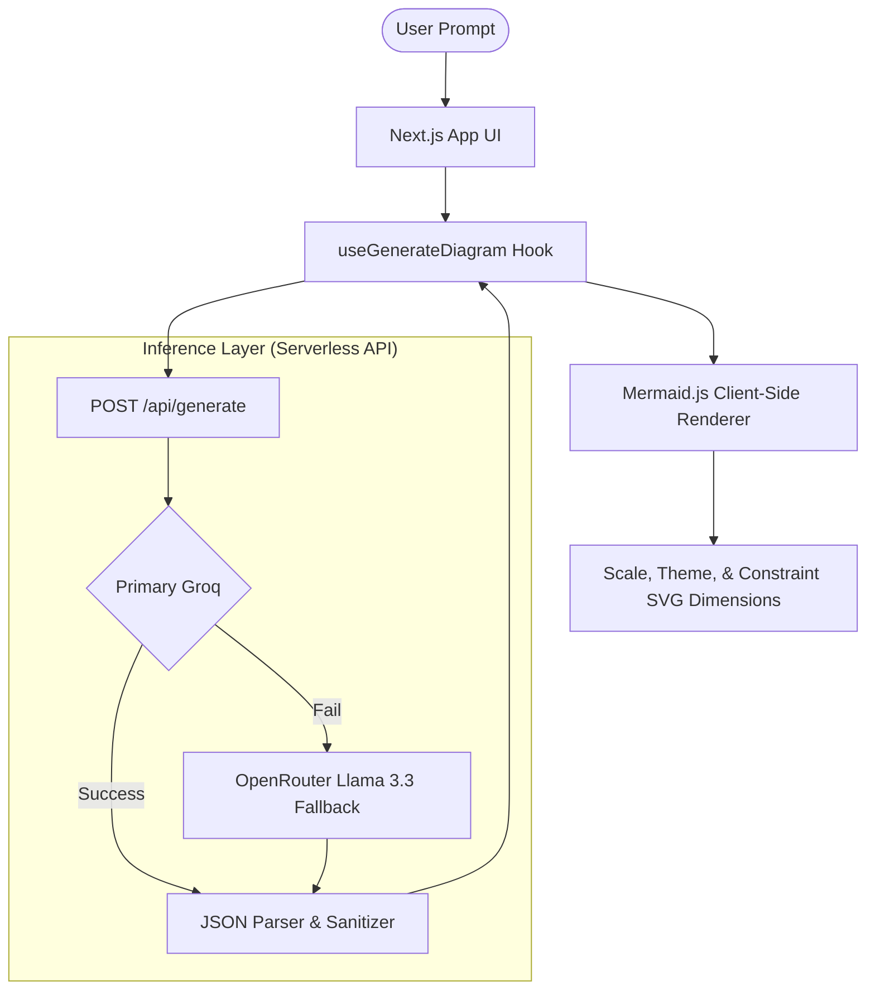

# DiagramAI 🧠

<p align="center">
  
  
  
  <br />
  
  
  
  
</p>

An industry-grade, AI-powered technical diagram generator designed for engineering students, educators, and software professionals. Convert any text, architectural concept, or codebase outline into clean, professional diagrams accompanied by technical theories instantly.

Built with **Next.js 14**, **Groq AI (Llama 3.1/3.3)**, **OpenRouter (as an automatic fallback)**, and **Mermaid.js** for client-side SVG rendering.

🔗 **Live Deployment:** [diagram-ai-gamma.vercel.app](https://diagram-ai-gamma.vercel.app/)

---

## 📺 Application Demo

https://github.com/user-attachments/assets/79ef7a57-297c-4fb4-98ea-5a7d0205e09c

---

## 🌟 Key Features

- ⚡ **Ultra-Fast Generation:** Generates diagrams in under 2 seconds using Groq's high-speed inference engine.
- 🎯 **Automated Diagram Typing:** The AI dynamically determines the best diagram type (Flowcharts, ERDs, Sequence Diagrams, State Diagrams, or Graphs) for your prompt.
- 🎨 **Adaptive Color Theming:** DiagramRenderer parses output SVGs and injects tailor-made color palettes suited to the diagram subject.
- 📖 **Comprehensive Educational Theory:** Each diagram is accompanied by a ~150-word synthesis, highlighting key points and real-world use cases.
- 💾 **Session History:** Keeps track of your last 8 generations in memory so you can hop back and forth instantly.
- 📦 **Export-Ready Output:** Copy raw Mermaid syntax or download production-ready SVGs with a single click.

---

## ⚙️ Architecture & Data Flow



### Supported Diagram Formats
- **Flowcharts (`flowchart TD`)** — Algorithms, workflows, control circuits (MCC/SPCC)
- **Sequence Diagrams (`sequenceDiagram`)** — Message-passing flows, API lifecycles, auth handshakes
- **Entity Relationship Diagrams (`erDiagram`)** — Databases, relational schemas, keys
- **State Diagrams (`stateDiagram-v2`)** — Lifecycles, finite automata, transitions
- **Graphs (`graph LR`)** — Network layers, hierarchical structures, mind maps

---

## 🚀 Cost Advantage at Scale

Traditional diagram generators rely on server-side image generation APIs (e.g., DALL-E) costing **$0.02 to $0.04 per request**. By outsourcing rendering to the client via **Mermaid.js** and using **Groq** text inference, DiagramAI is extremely cheap to scale.

| Monthly Generations | Server-Side Image Cost | DiagramAI Cost (Groq Llama 3.1 8B) | Savings |
|---------------------|------------------------|------------------------------------|---------|
| **1,000**           | ~$30.00                | **~$0.10**                         | 99.6%   |
| **10,000**          | ~$300.00               | **~$1.00**                         | 99.6%   |
| **100,000**         | ~$3,000.00             | **~$10.00**                        | 99.6%   |

---

## 🛠️ Getting Started

### Prerequisites
- Node.js 18.x or later
- npm or yarn

### 1. Clone the Repository
```bash
git clone https://github.com/TechWithAkash/diagram-ai.git
cd diagram-ai
```

### 2. Install Dependencies
```bash
npm install
```

### 3. Setup Environment Variables
Create a `.env.local` file in the root directory:
```bash
cp .env.example .env.local
```

Populate the following variables inside `.env.local`:
```env
# Groq Keys (Primary Engine)
GROQ_API_KEY=your_groq_api_key_here
GROQ_MODEL=llama-3.1-8b-instant
GROQ_MODEL_PRO=llama-3.3-70b-versatile

# OpenRouter Keys (Fallback Engine)
OPENROUTER_API_KEY=your_openrouter_api_key_here

# App Configurations
NEXT_PUBLIC_APP_NAME=DiagramAI
NEXT_PUBLIC_APP_URL=http://localhost:3000
```
> [!NOTE]
> You can acquire a free Groq API key from [Groq Console](https://console.groq.com) and an OpenRouter key from [OpenRouter Console](https://openrouter.ai).

### 4. Run Locally
Start the development server:
```bash
npm run dev
```
Open [http://localhost:3000](http://localhost:3000) in your browser to view the application.

### 5. Production Build
To create an optimized production build:
```bash
npm run build
npm run start
```

---

## 📁 Repository Structure

```
diagram-ai/
├── app/
│   ├── api/
│   │   └── generate/
│   │       └── route.js        # Groq API controller + retry fallback
│   ├── globals.css             # Scrollbar overrides, Next fonts & styling
│   ├── layout.js               # Page wrapper with Poppins fonts & head meta
│   └── page.js                 # Dashboard layout & state orchestrator
├── components/
│   ├── diagram/
│   │   └── DiagramRenderer.js  # Mermaid wrapper, custom SVGs, theming
│   └── ui/
│       ├── Badge.js            # Status tags & labels
│       ├── Button.js           # Reusable click target with state loaders
│       └── Tabs.js             # Client tab selector
├── lib/
│   ├── useGenerateDiagram.js   # Diagram generation fetching hook
│   ├── useHistory.js           # In-memory history cache
│   └── utils.js                # SVG export handlers, copy helpers, config
├── public/                     # Static assets
├── tailwind.config.js          # Design system, themes & animations
├── package.json                # Project dependencies
└── README.md                   # Developer documentation
```

---

## 🔒 License

Distributed under the MIT License. See `LICENSE` for more information.

---

## 🤝 Contributing & Contact

Contributions, issues, and feature requests are welcome! Feel free to check the [issues page](https://github.com/TechWithAkash/diagram-ai/issues).

- **GitHub Repository:** [TechWithAkash/diagram-ai](https://github.com/TechWithAkash/diagram-ai)
- **Author:** [Akash Vishwakarma](https://github.com/TechWithAkash)

---
<p align="center">Made with ❤️ for engineering developers and students</p>
