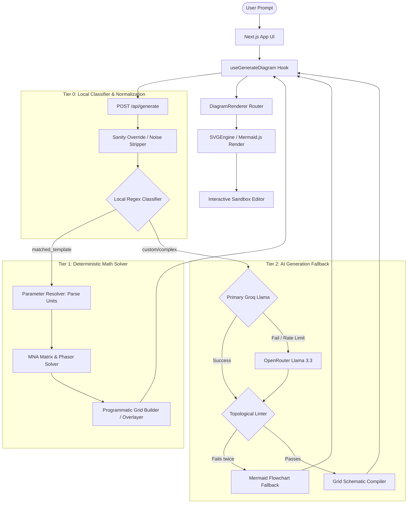

# DiagramAI 🧠

<p align="center">
  
  
  
  <br />
  
  
  
  
</p>

DiagramAI is a production-grade, AI-powered interactive diagram generator and numerical solver tailored for engineering students, educators, and software professionals. 

It combines **static syllabus matching (89 pre-verified textbook diagrams)**, **real-time linear circuit mathematical solvers (MNA Matrix Solver)**, **interactive client-side sandboxing**, and **AI-driven layout generation** into a seamless, high-fidelity browser experience.

🔗 **Live Deployment:** [diagram-ai-gamma.vercel.app](https://diagram-ai-gamma.vercel.app/)

---

## 📺 Application Demo

https://github.com/user-attachments/assets/79ef7a57-297c-4fb4-98ea-5a7d0205e09c

---

## 🚀 Key Highlights & Visual Polish

### 1. Zero-Hallucination Numerical Circuit Engine
Rather than relying on LLMs to perform arithmetic or draw coordinates from scratch (which frequently leads to overlapping parts, wrong values, and floating pins), DiagramAI utilizes a **deterministic hybrid solver pipeline**:
* **Parameter Normalization:** Automatically resolves unit formats (e.g. `uF`, `μF`, `mH`, `k ohm` to float values) in [parameterResolver.js](file:///Users/akashvishwakarma/Downloads/diagramai/lib/parameterResolver.js).
* **Modified Nodal Analysis (MNA) Matrix Solver:** Solves impedances, phasor angles, branch currents, node voltages, and power factors locally in [deterministicSolver.js](file:///Users/akashvishwakarma/Downloads/diagramai/lib/deterministicSolver.js) using Gaussian elimination.
* **Programmatic Grid Builders:** Automatically lays out circuits horizontally or vertically using a dynamic orthogonal netlist compiler in [programmaticSchematicBuilder.js](file:///Users/akashvishwakarma/Downloads/diagramai/lib/programmaticSchematicBuilder.js).

### 2. Premium SVG Typography & Layout (No Messy Overlaps)
We implemented strict visual quality controls to make diagrams publication-ready:
* **White Text Halos:** All free labels, calculated overlays, and component pins marker characters are wrapped in a 3px white outline (`stroke="#FAFBFC" style={{ paintOrder: "stroke fill" }}`). Wires and lines pass cleanly behind the text, preventing intersections.
* **Perpendicular Label Offsets:** Vertical components center their labels horizontally to the side `x = 0, y = -(labelOffset + 2)`, while horizontal components place theirs below or above the body, completely eliminating overlaps with terminal lead wires.

### 3. Interactive Client Sandbox
If a diagram has warning flags, students can launch the **Interactive Sandbox Editor**. Students can:
* Drag and drop components to rewrites or adjust coordinate spacing.
* Edit component parameters (such as resistance, capacitance, and source voltages) in the sidebar.
* Recompute and visualize node voltages and branch currents in real-time.

### 4. 4-Tier Defense Pipeline & Topological Linter
1. **Local Classifier Match:** Detects if the prompt matches high-frequency syllabus templates (e.g. star-delta, superposition, Norton, Thevenin).
2. **Syllabus Overrides:** Deterministically fixes common classifier drifts (e.g., star to delta conversion prompts).
3. **Topological Linter:** Verifies that active circuits (Op-Amps, BJTs) have Ground references, Vcc power rails, no Vcc-to-Ground short circuits, and no floating pins.
4. **Mermaid Fallback:** Bypasses coordinate layouts and degrades gracefully to a topological graph if AI layouts fail validation.

---

## ⚙️ System Architecture & Data Flow

The following sequence illustrates how a user prompt is classified, resolved, solved mathematically, and compiled into a styled diagram:



---

## 📚 Mumbai University Syllabus Diagram Catalog
To guarantee textbook accuracy, DiagramAI includes **89 pre-verified diagrams** mapped to departments and semesters based on syllabus requirements. Below are the core categories in [lib/catalog/](file:///Users/akashvishwakarma/Downloads/diagramai/lib/catalog):

### 🎒 First Year Engineering (FE)
* **Basic Electrical Engineering (BEE):**
  * Superposition Theorem Circuit (`superposition-theorem-circuit`)
  * Thevenin's Equivalent Circuit (`thevenins-theorem-circuit`)
  * Norton's Equivalent Circuit (`norton-equivalent`)
  * Balanced 3-Phase Star Connection (`star-connection`)
  * Balanced 3-Phase Delta Connection (`delta-connection`)
  * Transformer Equivalent Circuit Model (`transformer-equivalent-circuit`)
  * Single Phase Transformer (`single-phase-transformer`)
  * Series RLC AC Circuit (`ac-rlc-circuit`)
  * Series RL Circuit (`series-rl-circuit`)
  * DC & AC Circuit Solvers (`dc-circuit` / `ac-circuit`)
* **Engineering Physics & Chemistry:**
  * Total Internal Reflection in Optical Fiber (`optical-fiber-tir`)
  * Zeolite Water Softening Process Flow (`zeolite-process-flow`)

### 💻 Computer Engineering (CMPN) & IT
* **Data Structures & Algorithms (DS/DSA):**
  * Binary Search Tree (BST) Structure (`binary-search-tree`)
  * AVL Tree Structure (`avl-tree`)
  * Heap Structure & Array Map (`heap-structure`)
* **Database Management Systems (DBMS):**
  * Three-Schema Database Architecture (`three-schema`)
  * DBMS System Architecture (`dbms-architecture`)
  * Transaction State Transition Diagram (`dbms-transaction-state`)
  * B+ Tree Node Structure (`bplus-tree`)
  * Entity-Relationship (ER) Notation Table (`er-notation-table`)
* **Operating Systems (OS):**
  * Process Life Cycle (5-State Model) (`process-life-cycle`)
  * Process Life Cycle (7-State Model) (`process-7state-cycle`)
  * Memory Hierarchy Diagram (`memory-hierarchy`)
  * Paging Hardware Architecture (`paging-hardware`)
  * Segmentation Hardware Architecture (`segmentation-hardware`)
  * Translation Lookaside Buffer (TLB) Hardware (`tlb-hardware`)
  * Deadlock Resource Allocation Graph (RAG) (`deadlock-rag`)
* **Computer Networks (CN):**
  * OSI Reference Model (7 Layers) (`osi-model`)
  * TCP/IP Model (4 Layers) (`tcp-ip-model`)
  * TCP 3-Way Handshake Connection (`tcp-handshake`)
  * DNS Resolution Process (`dns-resolution`)
  * ARP Address Resolution Protocol (`arp-protocol`)
  * CSMA/CD Flow Chart (`csma-cd-protocol`)
  * Ethernet Frame Structure (IEEE 802.3) (`ethernet-frame`)
  * DHCP DORA Handshake (`dhcp-dora`)
  * CSMA/CA Protocol Flow (`csma-ca-flowchart`)
  * NAT Address Translation (`nat-translation`)
  * SMTP Mail Transfer Flow (`smtp-flow`)
  * HTTP Request-Response lifecycle (`http-request-response`)
  * Routing Algorithms Comparison (`routing-algorithms`)
* **Software Engineering (SE/SDLC) & Compilers:**
  * Software Development Lifecycle Models (`waterfall-model`, `v-model`, `agile-scrum`, `spiral-model`, `prototype-model`)
  * DFD Level 0 & Level 1 (Library, Hospital, Hotel Systems)
  * UML Diagrams (ATM Sequence, ATM Use Case, Library Class, Shopping Class)
  * Phases of a Compiler (`compiler-phases`)
  * Parse Tree for Arithmetic (`parse-tree`)
  * Finite Automata DFA (`dfa-automata`)

### 📡 Electronics & Telecommunication (EXTC)
* **Digital System Design (DSD) & Circuits:**
  * Half Adder & Full Adder Logic Implementations
  * 2-to-1 & 4-to-1 Multiplexers
  * SR Latch, D Flip-Flop, JK Flip-Flop (Gate & Block levels)
  * Flip-Flop Conversions (JK to D, D to JK)
  * 4-bit SISO Shift Register (`shift-register`)
  * 4-bit Ring Counter (`ring-counter`)
  * Decimation-in-Frequency (DIF) FFT Butterfly (`fft-butterfly-dif`)
  * Decimation-in-Time (DIT) FFT Butterfly (`fft-butterfly-dit`)
  * Signal Flow Graph & Mason's Gain (`signal-flow-graph`)
* **Linear Integrated Circuits (LIC):**
  * Op-Amp Inverting / Non-Inverting Amplifiers
  * Op-Amp Instrumentation Amplifier (`opamp-instrumentation`)
  * Op-Amp Integrator & Differentiator Circuits
  * Zener Voltage Regulator (`zener-voltage-regulator`)
  * BJT Switch Circuit (`bjt-switch-circuit`)

---

## 🛠️ Getting Started

### Prerequisites
* Node.js 18.x or later
* npm or yarn

### 1. Clone the Repository
```bash
git clone https://github.com/TechWithAkash/diagram-ai.git
cd diagram-ai
```

### 2. Install Dependencies
```bash
npm install
```

### 3. Setup Environment Variables
Create a `.env.local` file in the root directory:
```bash
cp .env.example .env.local
```

Populate the following variables inside `.env.local`:
```env
# Groq Keys (Primary Engine)
GROQ_API_KEY=your_groq_api_key_here
GROQ_MODEL=llama-3.1-8b-instant
GROQ_MODEL_PRO=llama-3.3-70b-versatile

# OpenRouter Keys (Fallback Engine)
OPENROUTER_API_KEY=your_openrouter_api_key_here

# App Configurations
NEXT_PUBLIC_APP_NAME=DiagramAI
NEXT_PUBLIC_APP_URL=http://localhost:3000
```

*Acquire a free Groq API key from the [Groq Console](https://console.groq.com) and an OpenRouter key from the [OpenRouter Console](https://openrouter.ai).*

### 4. Run Locally
Start the Next.js development server:
```bash
npm run dev
```
Open [http://localhost:3000](http://localhost:3000) in your browser.

### 5. Production Build
To build and optimize Next.js (which compiles the background diagram catalog):
```bash
npm run build
npm run start
```

---

## 📁 Repository Structure
```
diagram-ai/
├── app/
│   ├── api/
│   │   ├── generate/
│   │   │   └── route.js        # Groq controller, MNA solver integration, linter correction loop
│   │   └── verify-request/     # Vercel-compatible file writes buffer
│   ├── globals.css             # Core styling, fonts & scrollbars
│   ├── layout.js               # Page wrapper with Poppins fonts
│   └── page.js                 # Dashboard & layout orchestrator (with standalone embed handler)
├── components/
│   ├── diagram/
│   │   ├── CircuitSandbox.jsx  # Interactive client-side circuit editor
│   │   └── DiagramRenderer.js  # SVGEngine vs Mermaid routing switcher & error boundary
│   └── engine/
│       ├── SVGEngine.jsx       # Custom SVG wrapper & master layout router
│       ├── primitives/         # SVG components (Block, Arrow, CircuitSymbol, BusLine)
│       └── renderers/          # Specific layout drawing (CircuitRenderer, LogicGate, Graph, Table)
├── lib/
│   ├── catalog/                # Syllabus database files categorized by department & semester
│   ├── diagrams/               # 89 verified syllabus diagram JSON schemas
│   ├── deterministicSolver.js  # MNA matrix solver & phasor calculations
│   ├── diagramLibrary.js       # Fuse.js library search index & matching engine
│   ├── gridSchematicCompiler.js# Compiles symbolic grid schematic to SVG coordinates & runs linter
│   ├── parameterResolver.js    # Normalizes units & extracts parameters from user prompts
│   ├── programmaticSchematicBuilder.js # Builds custom series, parallel, bridge, BJT, op-amp grids
│   └── utils.js                # SVG export handlers & copy helpers
└── scripts/
    └── compile-catalog.js      # Catalog compiler generating compiled-index.json at build-time
```

---

## 🔒 License
Distributed under the MIT License. See `LICENSE` for more information.

---

## 🤝 Contributing & Contact
Contributions, issues, and feature requests are welcome! Feel free to check the [issues page](https://github.com/TechWithAkash/diagram-ai/issues).

* **GitHub Repository:** [TechWithAkash/diagram-ai](https://github.com/TechWithAkash/diagram-ai)
* **Author:** [Akash Vishwakarma](https://github.com/TechWithAkash)

<p align="center">Made with ❤️ for engineering developers and students</p>
